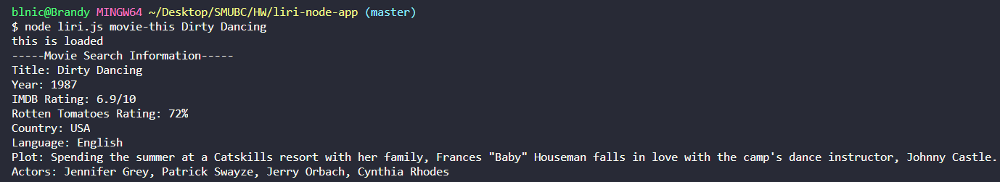
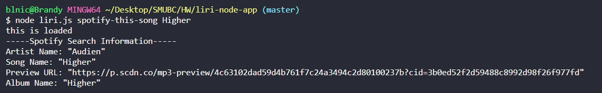

# **Liri-Node-App**
Find out where your favorite band will be playing, information about movies, and even spotify songs with this command line app.
## **Overview**
 Liri is a Language Interpretation and Recognition app that allows for users to search within the node command line to produce information about band events, movies, and songs.  The information that is searched will be produced in the terminal and it will also be written in a log.txt file.  The log.txt file will save all searched information. 
## **Instructions**
To use LIRI you need to have node.js and the npms that were used in the program. To install the npm's do npm install in the command line.  The searches are performed by typing in a specific command depending on if its a band, movie, or song that you are searching for. To perform a search you will need to type in the command line: **node liri.js <command for either movie, song, or band> <song, movie, or band name>**
Example for a movie search: node liri.js movie-this The Burbs
## **Commands for LIRI**
1. Band Search Command: **concert-this**
2. Song Search Command: **spotify-this-song**
3. Movie Search Command: **movie-this** 
## **Technical Information**
This app was created by using the following:
* JavaScript
* Node
* npms
   request
   Moment
   Bands in Town
   Spotify
   OMDB
## **Application Images**

**Concert Search**

**Movie Search**

**Spotify Search**

